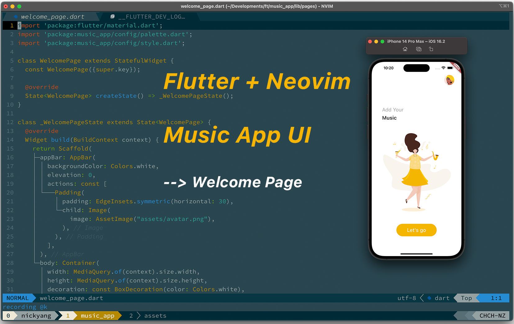
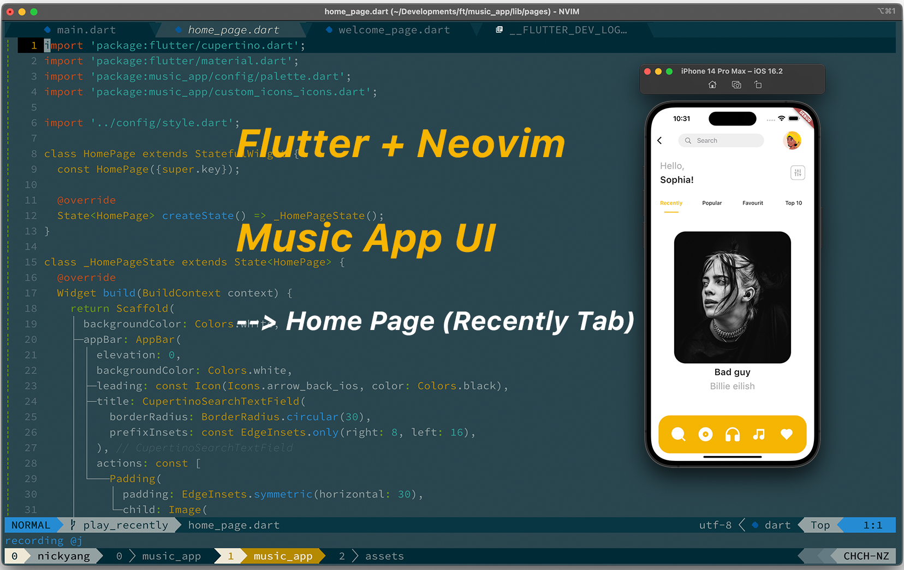
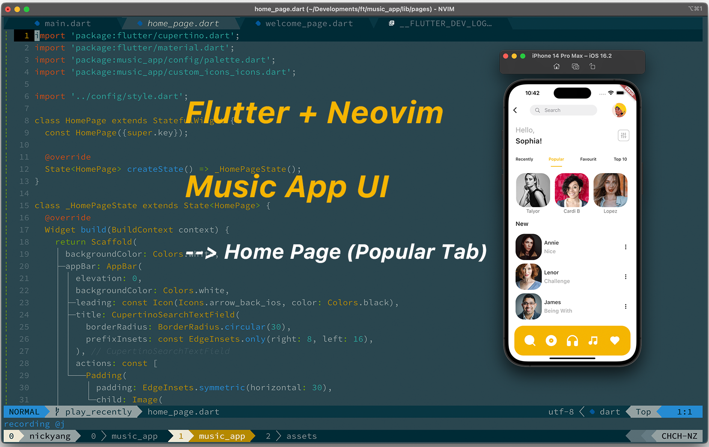
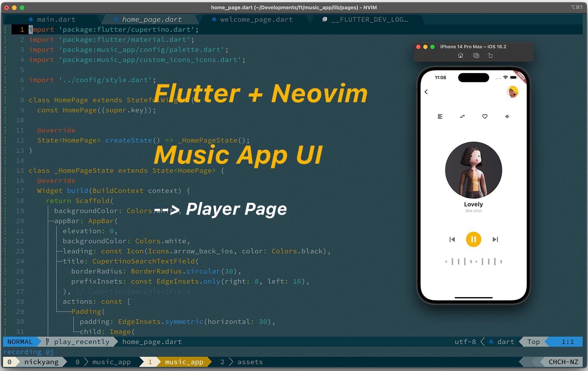

# Music Player App

Flutter + Neovim : Music Player App UI Quick Code: [Bilibili](https://space.bilibili.com/3493146444958402) | [YouTube](https://youtu.be/4RrqWIlKoq8).

This project is a Flutter quick code project base on ANANDU KRISHNA's great work: - [Figma Community design by ANANDU KRISHNA](https://www.figma.com/community/file/1110531417005100310/music).

### OutCome:

